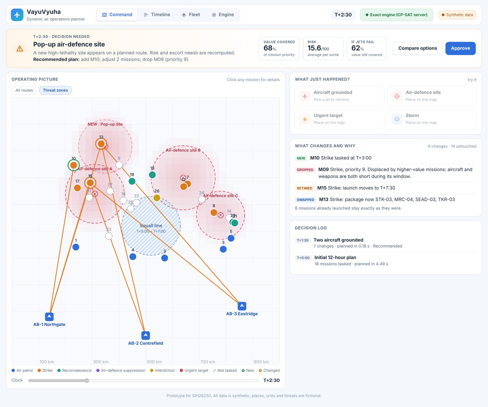
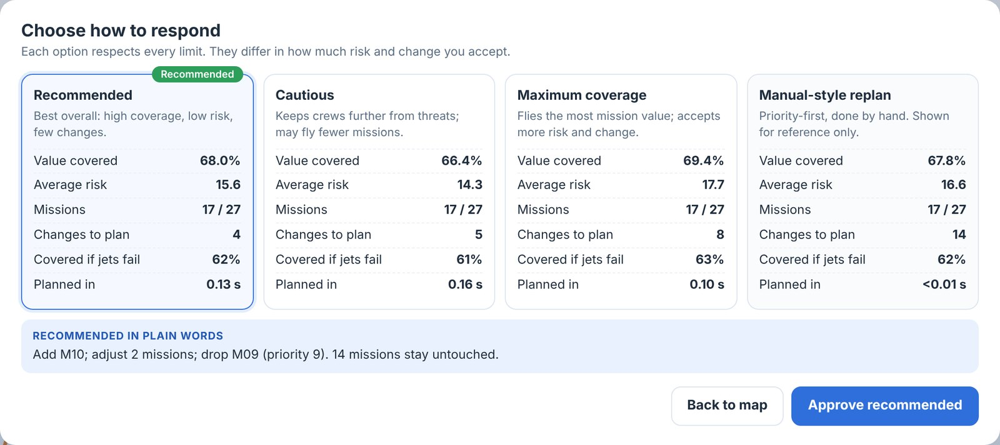
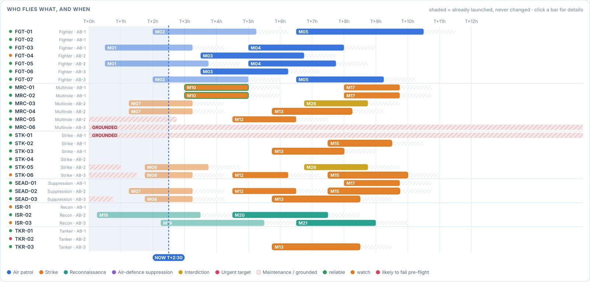

# VayuVyuha

**AI decision support for dynamic air operations and resource optimisation.**
Working prototype for Smart India Hackathon 2026, problem statement **SIH26250** (Air Power: Dynamic Air Operations & Resource Optimisation).

> All data is synthetic and fictional: a made-up 1000 x 1000 km theatre, no real geography, units or threats.

**Live prototype:** https://thotapremkumar-tpk.github.io/VayuVyuha/



## What it does

VayuVyuha fuses aircraft, crew, weapon, airspace, weather and threat data into one live picture. When something changes it
re-plans in under a second, proposes ranked options in plain language, explains every change, and waits for a commander to
approve. Sorties that have already launched are never changed.

| View | What you see |
|---|---|
| **Command** | Status line, map, four event buttons (grounded aircraft, air-defence site, urgent target, storm), change list with reasons |
| **Timeline** | Every sortie by aircraft; launched sorties shaded, grounded aircraft hatched |
| **Fleet** | Each base: weapon stock, crew hours, predicted chance an aircraft fails pre-flight |
| **Engine** | Nine rule checks, how the plan was found, plan confidence over 1,000 simulated days, risk-versus-coverage trade-off |

| Options screen | Timeline |
|---|---|
|  |  |

## Try it

**In the browser, no install.** Open the live link above, or download this repository and open `index.html`.
It uses the built-in engine, which plans inside the browser.

**With the exact engine.**
```bash
pip install -r requirements.txt
python3 server.py            # then open http://localhost:8000
```
The app detects the server and switches to "Exact engine (CP-SAT server)". Click the engine badge to switch back.

## How it works

Decide which missions fly, when they launch, and which aircraft, crew and weapons fill each package, subject to nine rule
families: package roles, range or tanker, serviceability, turnaround, crew duty, weapon stock per base, runway launch cap,
weather windows, and escort inside air-defence zones. Maximise priority-weighted mission value minus threat risk, reliability
risk, flight time, delay and plan change. On an event, sorties already launched are fixed and the rest is re-planned from the
current plan.

Two engines implement the same rules and objective:

- **Exact engine** (`solver.py`): Google OR-Tools CP-SAT, plus CP-SAT with large-neighbourhood search for big fleets.
- **Built-in engine** (`web/engine.js`): best-insertion construction and adaptive large-neighbourhood search in JavaScript.

## Results on synthetic scenarios

The baseline is a priority-first sequential planner used as a stand-in for manual planning.

| Measure | Result |
|---|---|
| Plan quality, 20 scenarios (28 aircraft, 27 missions) | +2.3 points priority coverage, 26% lower sortie risk, score +11.8% |
| Re-plan time after an event | 0.06–0.18 s exact engine; 0.35 s built-in engine |
| Plan changes per event | 4 vs 14 for the baseline |
| Built-in engine vs exact solver | 98.9% of the exact score in 0.3 s |
| Scale, 112 aircraft and 108 missions | +6.6% over the baseline in 2 s |
| Rule violations | 0 in 142 plans checked by an independent validator |

These are prototype results on synthetic data, not operational claims.

## Repository layout

| Path | Purpose |
|---|---|
| `index.html` | The complete app in one file (this is what GitHub Pages serves) |
| `web/` | App source: `engine.js`, `app.js`, `app.css`, `index.html` template |
| `build_app.py` | Bundles `web/` and the scenario into `index.html` |
| `solver.py`, `scenario.py`, `predict.py` | Exact engine and validator, scenario generator, aircraft readiness model |
| `server.py` | Serves the app and exposes `POST /api/solve` (stateless) |
| `export_scen.py`, `bench_scale.py`, `test_engine.js`, `scale_js.js`, `xval.js`, `xval_scale.js` | Benchmarks and cross-checks behind the results table |
| `data/` | Scenarios and benchmark outputs |
| `deck/` | SIH presentation. `build_deck.js` is kept for reference; it needs a theme helper that is not part of this repository |
| `video/` | Narrated walkthrough (MP4, subtitles) and the scripts that recorded it |

## Rebuild

```bash
python3 build_app.py          # regenerates index.html from web/ and data/
node test_engine.js 300       # built-in engine vs exact results on 20 scenarios
```
